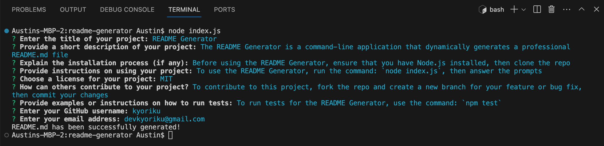
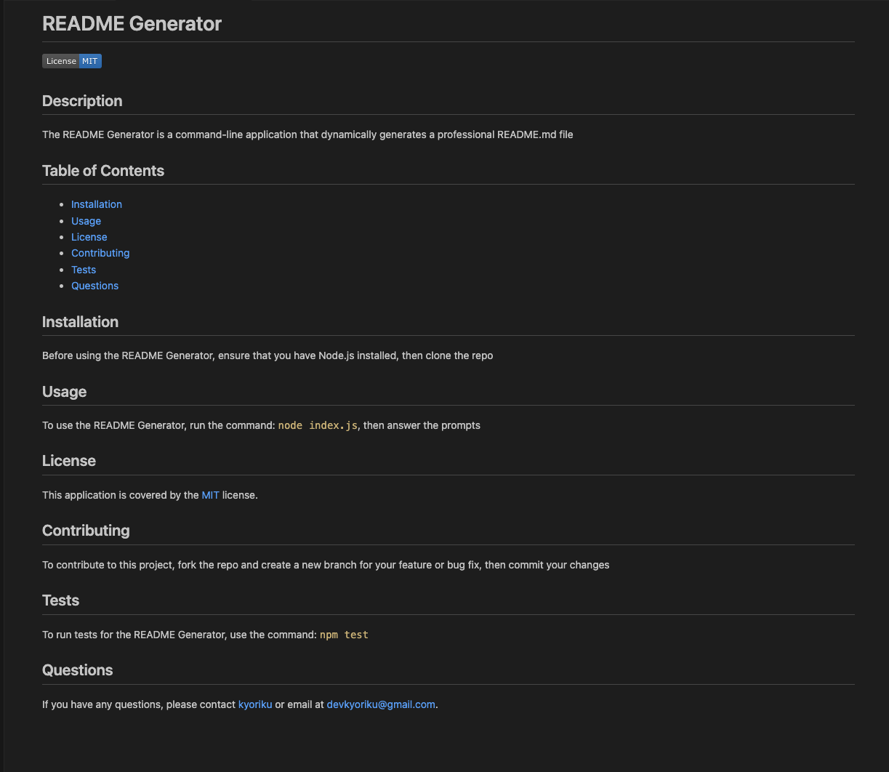

# README Generator

[](https://opensource.org/licenses/MIT)

## Description
The README Generator is a command-line application that dynamically generates a professional README.md file for your GitHub project. This application is built using the [Inquirer](https://www.npmjs.com/package/inquirer/v/8.2.4) package to prompt users for information about their application. It follows the guidelines outlined in the [Professional README Guide](https://coding-boot-camp.github.io/full-stack/github/professional-readme-guide), ensuring that your README includes essential sections such as Description, Table of Contents, Installation, Usage, License, Contributing, Tests, and Questions.

## Table of Contents
- [Installation](#installation)
- [Usage](#usage)
- [License](#license)
- [Contributing](#contributing)
- [Tests](#tests)
- [Questions](#questions)

## Installation
Before using the README Generator, ensure that you have Node.js installed on your machine.

### Check Node.js Installation
Check if you have Node.js installed by following these steps:

1. Open your terminal.
2. Run the following command:
    ```bash
    node -v
    ``` 
    If Node.js is installed, you will see a version number, for example: ` v20.10.0 `

### Install Node.js (if not already installed)
If you don't have Node.js installed, follow these steps:

1. To install Node.js, visit the official [Node.js](https://nodejs.org/) website and download the recommended version for your operating system.
2. Follow the installation instructions provided on the Node.js website.

### Continue with README Generator Installation
Once Node.js is installed, you can proceed with the installation of the README Generator by following these steps:

1. Clone the repository to your local machine.
2. Open your terminal and navigate to the project directory.
3. Run the following command to install the required dependencies:
    ```bash
    npm install
    ```
Now you're ready to use the README Generator!

## Usage
To use the README Generator, follow these steps:

1. Open your terminal and navigate to the project directory.
2. Run the following command:
    ```bash
    node index.js
    ```
3. Answer the prompts to provide information about your project, including the title, description, installation process, usage instructions, contribution guidelines, test instructions, license, GitHub username, and email address.
4. Once you've answered all the prompts, the README.md file will be generated in the root of your project.

### Demo Video 

https://github.com/kyoriku/readme-generator/assets/145511725/8bf09b71-0ecc-409f-957b-c6326f4964af

[Link to demo video](https://drive.google.com/file/d/1NNMy_CNtfVe0ny3bkDut3tGq-ukWLq4C/view?usp=sharing)

### Screenshots



## License
This application is covered by the [MIT](https://opensource.org/licenses/MIT) license.

## Contributing
If you want to contribute to this project, follow these steps:

1. Fork the repository.
2. Create a new branch for your feature or bug fix.
3. Make your changes and commit them with descriptive commit messages.
4. Push your changes to your branch.
5. Submit a pull request, explaining your changes.

## Tests
To run tests for the README Generator, use the following command:
```bash
npm test
```

## Questions
If you have any questions, please contact [kyoriku](https://github.com/kyoriku) or email at devkyoriku@gmail.com.
